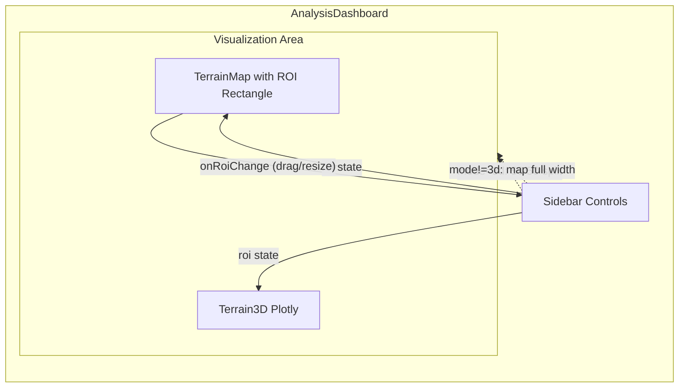

# Interactive 2D-to-3D ROI Selection with Side-by-Side Layout

## Current State

- [AnalysisDashboard.tsx](webui/src/pages/AnalysisDashboard.tsx) has three modes (terrain, solar, 3d) that **swap** the entire visualization area between `TerrainMap` and `Terrain3D`
- ROI is four hardcoded numeric values in state -- no visual selection on the map
- `TerrainMap` has no `onRoiChange` prop; it receives ROI read-only
- When switching to 3D mode, the Leaflet map unmounts entirely

## Target State




## Implementation

### 1. New Component: `EditableRoiRectangle`

Create [webui/src/components/EditableRoiRectangle.tsx](webui/src/components/EditableRoiRectangle.tsx)

A react-leaflet child component (uses `useMap()`) that renders:

- An `L.Rectangle` with a semi-transparent cyan fill and dashed border showing the current ROI
- **4 corner drag handles** as small `L.CircleMarker`s (radius ~6px, white fill, cyan border) positioned at each corner of the rectangle
- **1 center drag handle** (optional, slightly larger) for moving the entire rectangle

Interaction logic (all pure Leaflet, no extra dependencies):

- Each corner marker has `draggable: true`. On `drag`, recompute the rectangle bounds from the four corners and call `onRoiChange({ lat_min, lat_max, lon_min, lon_max })`
- When dragging a corner, the opposite corner stays fixed; the adjacent two corners update their lat/lon to maintain a rectangle shape
- The center marker moves all four corners in unison (pan the rectangle)
- Debounce `onRoiChange` calls (~300ms) during active dragging to avoid hammering the 3D fetch, then fire a final call on `dragend`
- Coordinate normalization: lon values get `normalizeLon180()` before passing to `onRoiChange` (matching the map's EPSG:4326 CRS with [-180, 180] bounds)

Props:

```typescript
interface EditableRoiRectangleProps {
  roi: { lat_min: number; lat_max: number; lon_min: number; lon_max: number }
  onRoiChange: (roi: { lat_min: number; lat_max: number; lon_min: number; lon_max: number }) => void
  color?: string       // default: '#06b6d4' (cyan-500)
  interactive?: boolean // default: true, set false to make read-only
}
```

### 2. Update `TerrainMap` to Accept ROI Editing

Edit [webui/src/components/TerrainMap.tsx](webui/src/components/TerrainMap.tsx):

- Add `onRoiChange?: (roi: ...) => void` to `TerrainMapProps`
- Inside `<MapContainer>`, render `<EditableRoiRectangle>` when `onRoiChange` is provided:
  ```tsx
  {onRoiChange && (
    <EditableRoiRectangle
      roi={targetRoi}
      onRoiChange={onRoiChange}
    />
  )}
  ```
- This replaces the existing `roiBounds` / `FitBounds` logic when the rectangle is editable (the rectangle itself shows the ROI, so `FitBounds` only fires on initial load or dataset change, not on every ROI edit)

### 3. Update `AnalysisDashboard` for Side-by-Side Layout

Edit [webui/src/pages/AnalysisDashboard.tsx](webui/src/pages/AnalysisDashboard.tsx):

**Layout change** -- the main visualization area becomes:

```tsx
<div className="flex-1 relative bg-black flex">
  {/* 2D Map: always mounted, resizes when 3D is active */}
  <div className={`relative transition-all duration-300 ${mode === '3d' ? 'w-1/2' : 'w-full'}`}>
    <TerrainMap
      roi={roi}
      dataset={dataset}
      overlayType={overlayType}
      overlayOptions={{ colormap, relief, sunAzimuth, sunAltitude }}
      showSites={true}
      showWaypoints={true}
      onRoiChange={setRoi}  // <-- NEW: enable interactive rectangle
    />
  </div>

  {/* 3D Mesh: appears alongside when in 3D mode */}
  {mode === '3d' && (
    <div className="w-1/2 relative border-l border-gray-700">
      <Suspense fallback={...}>
        <Terrain3D roi={roi} dataset={dataset} ... />
      </Suspense>
    </div>
  )}
</div>
```

Key behavioral changes:

- **TerrainMap is always mounted** (no more unmount/remount when toggling 3D). This avoids losing Leaflet state.
- When entering 3D mode, the map container shrinks from 100% to 50%. We need a `MapResizeHandler` child component that calls `map.invalidateSize()` after the CSS transition completes (~350ms timeout, or via `transitionend` event).
- The `onRoiChange={setRoi}` prop enables the interactive rectangle in ALL modes, not just 3D, so the user can visually adjust the analysis region at any time.

### 4. Add `MapResizeHandler` Helper

Add a small helper inside [TerrainMap.tsx](webui/src/components/TerrainMap.tsx) (or as a separate component):

```tsx
function MapResizeHandler() {
  const map = useMap();
  useEffect(() => {
    const observer = new ResizeObserver(() => {
      map.invalidateSize({ animate: false });
    });
    observer.observe(map.getContainer());
    return () => observer.disconnect();
  }, [map]);
  return null;
}
```

Render `<MapResizeHandler />` inside `<MapContainer>` to handle any container size changes smoothly.

### 5. Update HUD Overlay Positioning

In [AnalysisDashboard.tsx](webui/src/pages/AnalysisDashboard.tsx), the HUD overlay that shows `LAT/LON/ZOOM` at top-right is positioned `absolute` relative to the main viz area. Move it inside the map's `<div>` so it stays anchored to the map panel in side-by-side mode.

## Files Changed Summary

| File | Change |

|------|--------|

| `webui/src/components/EditableRoiRectangle.tsx` | **New** -- interactive rectangle component |

| `webui/src/components/TerrainMap.tsx` | Add `onRoiChange` prop, render `EditableRoiRectangle`, add `MapResizeHandler` |

| `webui/src/pages/AnalysisDashboard.tsx` | Side-by-side layout, always-mount TerrainMap, pass `onRoiChange` |

No new npm dependencies required -- all built with Leaflet's native API via `useMap()`.